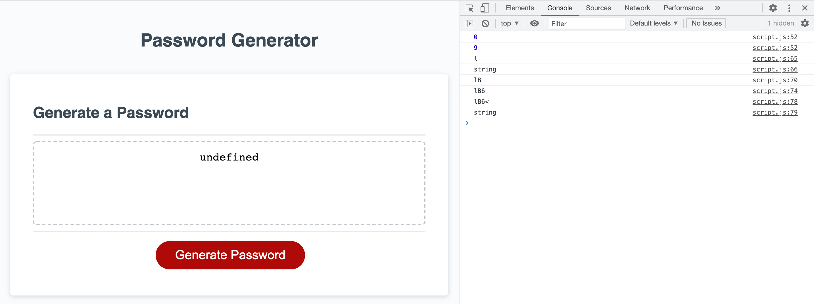

# Password-Generator

As a user, I want an program that can generate a random password meeting specified character criteria, so that I can create secure passwords to keep my information and documents safe.

Deployed Application: [Password Generator](https://florenciab94.github.io/Password-Generator/)

## Installation

To look at the project, follow GitHub's instructions on how to clone a repository to your computer here:
[Cloning a Repository](https://docs.github.com/en/github/creating-cloning-and-archiving-repositories/cloning-a-repository-from-github/cloning-a-repository "GitHub's guide to cloning a repository")

# Credits

[W3 Schools](https://w3schools.com/css/)

## License

[MIT](https://choosealicense.com/licenses/mit/)
